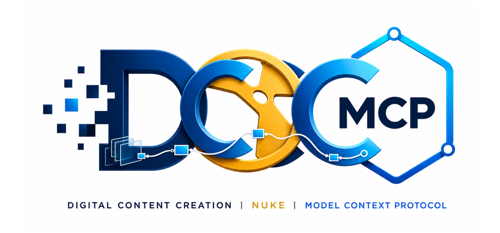
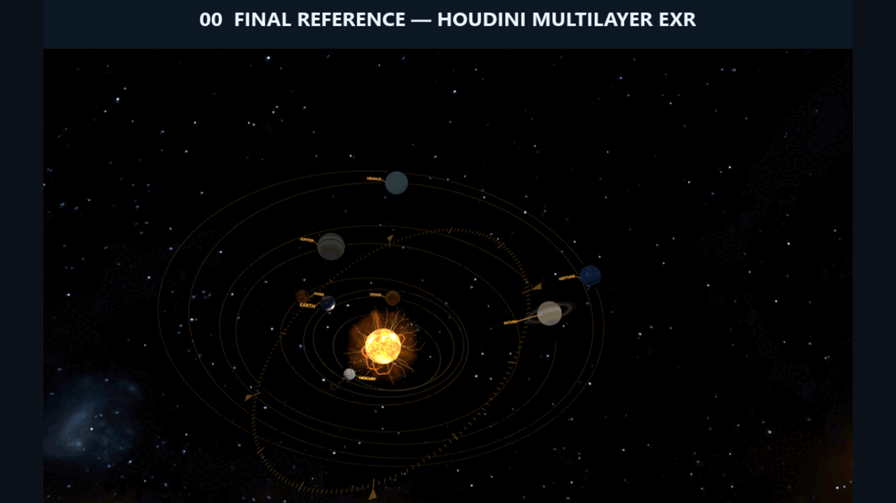

# dcc-mcp-nuke

<p align="center">
  
</p>

## Agent workflow

AI agents should use the shared gateway through `dcc-mcp-cli`; IDE users may
continue to use the MCP endpoint. Prefer typed skills and tools over raw scripts.

```bash
dcc-mcp-cli dcc-types
dcc-mcp-cli list
dcc-mcp-cli search --query "<task>" --dcc-type nuke
dcc-mcp-cli describe <tool-slug>
dcc-mcp-cli call <tool-slug> --json '{"key":"value"}'
```

`dcc-types` reports release-catalog support; `list` reports live sessions. If a
tool belongs to an inactive progressive skill, call `dcc-mcp-cli load-skill <skill-name> --dcc-type nuke` before retrying. For post-task improvement,
attach a stable session id with `--meta-json`, query `dcc-mcp-cli stats --range 24h --session-id <task-id>`, then pass the bounded evidence to the
`review_skill_improvement` prompt from `dcc-mcp-skills-creator`.


Nuke adapter for the DCC Model Context Protocol. It embeds a Streamable HTTP
MCP server in Nuke and uses Nuke's main-thread execution API for scene tools.

## Automated Houdini AOV compositing



This real Nuke session shows `nuke-layered-compositing` progressively building
a typed Beauty, emission-core, emission-bloom, volume, and output graph before
rendering the result. The multilayer EXR source was rendered from a solar-system
scene built in Houdini with
[`dcc-mcp-houdini`](https://github.com/dcc-mcp/dcc-mcp-houdini); Nuke reads the
Houdini Beauty, `all_emission`, and `all_volume` AOVs rather than bundled sample
footage.

```bash
python -m pip install dcc-mcp-nuke
```

Add the installed package's `dcc_mcp_nuke/nuke_plugin` folder to `NUKE_PATH`.
Nuke loads its `init.py` and asks the operating system for an available instance
port. Use `dcc-mcp-cli list` or the stable gateway at
`http://127.0.0.1:9765/mcp` to discover and connect to the running instance.
Set `DCC_MCP_NUKE_PORT` only when a fixed direct port is required.

The bundled `nuke-script` skill can open an existing absolute `.nk` path,
inspect scripts and nodes, sample bounded per-channel AOV statistics, and
explicitly save the current script. Releases are published through
`release.yaml` and the GitHub `pypi` environment.

The `nuke-node-assets` skill packages reusable, versioned Gizmos with an
explicit public knob interface, instantiates saved assets, and validates live
instances. Its registered tools use `DCC_MCP_NUKE_PLUGIN_ROOT`, stable ids and
versions, bounded typed knobs, and reject executable callbacks.

The `nuke-layered-compositing` skill supports ordered global and
Cryptomatte-scoped gain, saturation, edge-feather, and bounded albedo-fill
adjustments without changing pixels outside the selected material.
